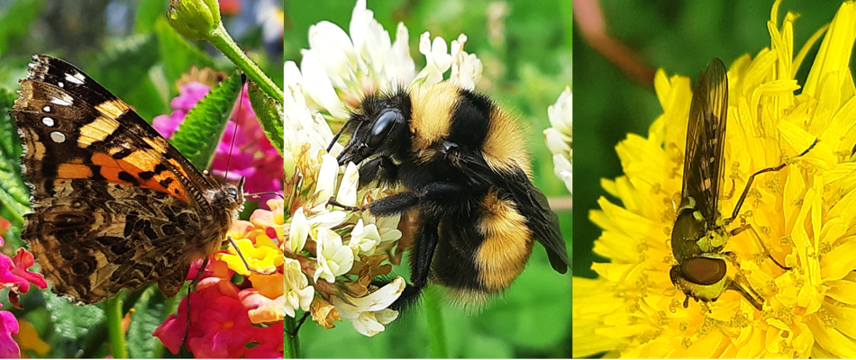
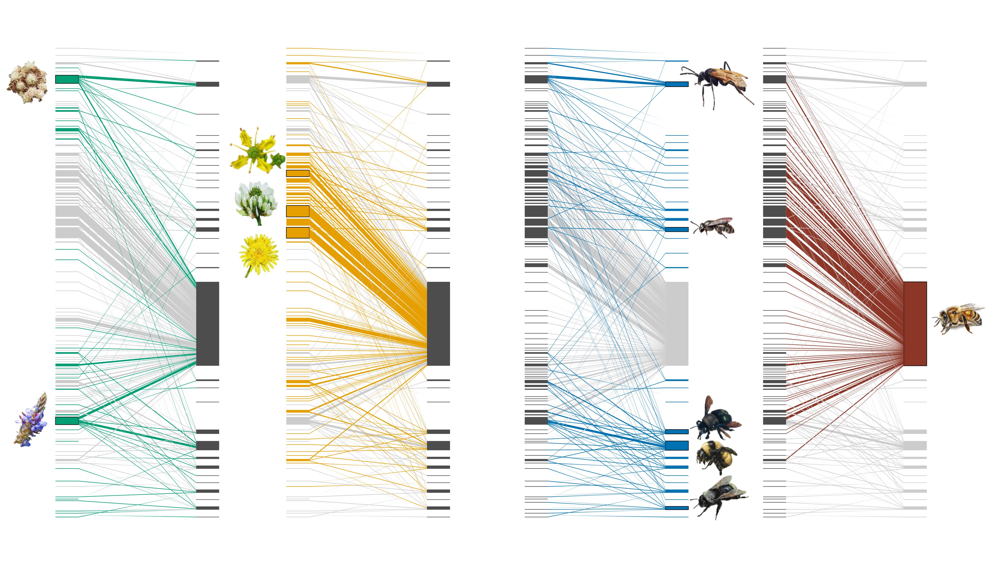
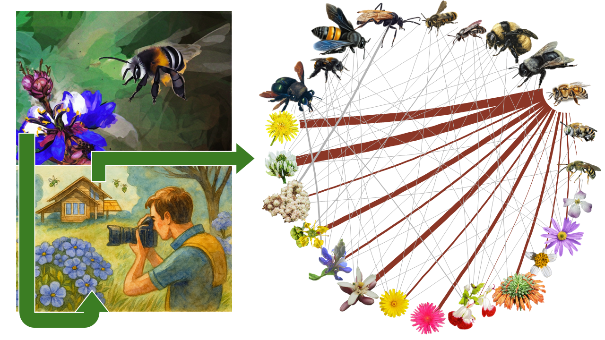

The following code describes the analytical workflow used to process insect–plant interaction data, construct bipartite ecological networks, perform multivariate analyses, calculate species-level network metrics (e.g., degree, species strength, centrality, and specificity), and evaluate patterns of interaction structure among taxa. The workflow includes data management, analysis and visualization.

Explanatory notes are provided throughout to improve transparency, reproducibility, and interpretation of each analytical step.

This code is intended as supplementary material accompanying the manuscript and documents the procedures used to generate figures, tables, and network analyses reported in the study.

```{r setup, include=FALSE}
knitr::opts_chunk$set(
  echo = TRUE,
  collapse = FALSE,     # combina código y output en un solo bloque
  comment = "#>",       # formato para el output
  fig.align = "center",
  fig.width = 8,
  fig.height = 5,
  out.width = "100%")

knitr::opts_knit$set(root.dir = here::here())
```

```{css, echo=FALSE}
.box {border: 1px solid #cccccc;
      padding: 10px;
      margin: 10px 0;
      background-color: #f9f9f9;
      border-radius: 5px; }
```

::: box
**Scientific Manuscript:**

Velasco-Cedeño D, Miranda-Moyano N, Moya GF, Cisneros-Heredia DF.
<i>Ecological Patterns of Hymenopteran Pollinators in an Andean Urban
Area Derived from Participatory Science. Submitted manuscript, under consideration in *Journal of Urban Ecology*.
:::



```{r image decoration, echo=FALSE, fig.align="center"}
#knitr::include_graphics("iNat_Project_Background.png")
```

# First Steps
## Load Packages

This section loads the R packages required for data import, manipulation, visualization, and network analysis. The conflicted package is used to explicitly prioritize `dplyr::select()` and `dplyr::filter()` when functions with the same names are available from multiple packages.

```{r load packages, message=FALSE, warning=FALSE}
#load list of packages
invisible(lapply(c("readxl", "readr", "writexl", "GGally",
                   "patchwork", "reshape2", "factoextra",
                   #packages for networks
                   "bipartite", "igraph",
                   #dplyr for data mgmt and ggplot2 for figures and maps
                   "tidyverse"),
                 library, character.only = T))

#resolve conflict between packages
conflicted::conflict_prefer("select", "dplyr")
conflicted::conflict_prefer("filter", "dplyr")
```

## Import Data

The raw interaction dataset is imported from an Excel file. This file contains the compiled records of hymenopteran insects and their associated plant taxa used in the subsequent community and network analyses.

```{r import data}
#import database
master0  <-  read_excel("Datos/Data/Rawdata_Hymenoptera.xlsx")
```

The interaction dataset used in this analysis was derived from participatory science records obtained through the iNaturalist platform. Records correspond to observations from the inter-Andean valley of Quito, Ecuador. Observations were manually reviewed, curated, and identified to the lowest feasible taxonomic level. Only records showing potential pollination interactions (i.e., insects in contact with or near reproductive floral structures) were retained for the analyses.


## Data Management

This section filters the dataset to retain taxonomic information relevant to the insect–plant interaction analyses at the species level. Records identified only as “Indet” are removed to avoid including unresolved taxa.

```{r data mgmt}
#select taxa information
master  <-  master0 %>%  select(15:24) %>% mutate_at(1:10, factor) %>%
                         rename(Origin = associatedTaxonEstablishmentMeans)

#remove indet values: records at species-level
m1      <-  master  %>%
            filter(scientificName  != "Indet", associatedTaxon != "Indet")

#create matrix playing with "table" function
m1      <-  as.data.frame.matrix(table(m1$scientificName, m1$associatedTaxon))

#order of species
spp     <-  read_excel("Datos/Data/Species Order.xlsx")
m1      <-  m1[, names(spp)]      #set plant species in taxonomic order

class(m1)

#summary
summary(master)
```

## Lists of Species

This section generates species lists for both hymenopteran insects and plants recorded in the interaction dataset. The objective is to summarize the taxonomic composition of the community and provide an overview of the observed taxa.

```{r species lists}
#list of insects
list_insect <-  master %>%
                mutate(family = ifelse(scientificName == "Indet", "Indet",
                                       as.character(family)),
                       tribe  = ifelse(scientificName == "Indet", "Indet",
                                       as.character(tribe))) %>%
                group_by(family, tribe, scientificName) %>%
                summarise(Freq = n(), .groups = "drop") %>%
                mutate(Rel_Abund = (Freq / sum(Freq)))  %>% arrange(-Freq)

#list of plants
list_plant  <-  master %>%
                mutate(associatedTaxonFamily = ifelse(
                    associatedTaxon == "Indet", "Indet",
                    as.character(associatedTaxonFamily))) %>%
                group_by(associatedTaxonFamily,
                         associatedTaxon, Origin) %>%
                summarise(Freq = n(), .groups = "drop") %>%
                mutate(Rel_Abund = (Freq / sum(Freq)) )  %>% arrange(-Freq)
```

# Visualization
## General

This section visualizes the full species-level insect–plant interaction network using plotweb(). In this bipartite graph, insects and plants are represented as two separate sets of nodes, while the links between them represent observed interactions. The width of each link reflects interaction frequency, allowing highly connected taxa and dominant interactions to be visually identified.

```{r include=FALSE}
plotweb <- plotweb_deprecated
```
```{r main network, fig.height=5, fig.width=9}
### PLOTTING  << Insect-Plant Networks >> ###
#png("fig1.png", width = 8, height = 5.5, units = "in", res = 300)
#pdf("fig1.pdf", width = 8, height = 5.5)
#par(mar = c(0, 0, 0, 0), oma = c(0, 0, 0, 0))  # márgenes pequeños
plotweb(m1, method  = "cca",
            col.interaction = "grey20",   # color de la interacción
            col.high = "#2E8B57",         # color de especies arriba
            col.low  = "#EEC900",         # color de especies abajo
            bor.col.interaction = NA,     # bordes
            bor.col.high = NA, 
            bor.col.low  = NA,
            y.width.high = 0.1,           # ancho de bloques
            y.width.low	 = 0.1,
            low.y    = 0.675,             # posición de boxes en el y-axis
            high.y   = 1.6,
            text.rot = 90,                # rotación de texto
            labsize  = 0.7,               # tamaño de label
            #ybig     = 1.3,              # dis entre upper and lower boxes
            arrow    = "no",              # forma geométrica de la conexión
            high.lablength = 0)           # num de caracteres en etiquetas
#dev.off()
```

## Colored by Origin

These plots use the same species-level interaction matrix but modifies the colors to highlight interactions involving *Apis mellifera* or native insect, and alien or native plant species.

```{r colored networks, fig.height=5, fig.width=9}
#color Apis mellifera
plotweb(m1, method = "cca", col.interaction = c(rep("grey80", 1020),
        rep("#8B3626", 204), rep("grey80", 8976)), col.high = "grey30",
        col.low  = c(rep("grey80", 5), rep("#8B3626", 1),
        rep("grey80", 44)), bor.col.interaction = NA, bor.col.high = NA,
        bor.col.low = c(rep(NA, 5), rep("black", 1),
        rep(NA, 44)), low.y = 0.40, high.y = 1.6, text.rot = 90,
        labsize  = 0.7, high.lablength = 0, low.lablength = 0)

#color native insects
plotweb(m1, method = "cca", col.interaction = c(rep("#0072B2", 1020),
        rep("grey80", 204), rep("#0072B2", 8976)), col.high = "grey30",
        col.low  = c(rep("#0072B2", 5), rep("grey80",  1),
        rep("#0072B2", 44)), bor.col.interaction = NA, bor.col.high = NA, 
        bor.col.low = c(rep(NA, 8), rep("black", 2), rep(NA, 15),
        rep("black", 1), rep(NA, 11), rep("black", 1), rep(NA, 11),
        rep("black", 1)), low.y = 0.40, high.y = 1.6, text.rot = 90,
        labsize  = 0.7, high.lablength = 0, low.lablength = 0)

#color native plants
m1 %>% t() %>%
  plotweb(method = "cca", col.interaction = c(rep("grey80", 200),
        rep("grey80", 6050), rep("#009E73", 3950)), col.high = "grey30",
        col.low = c(rep("grey80", 4), rep("grey80", 123),
        rep("#009E73", 79)), bor.col.interaction = NA, bor.col.high = NA, 
        bor.col.low  = c(rep(NA, 131), rep("black", 1), rep(NA, 10),
        rep("black", 1), rep(NA, 61)), low.y = 0.40, high.y   = 1.6,
        text.rot = 90, labsize  = 0.7, high.lablength = 0, low.lablength  = 0)

#color alien plants
m1 %>% t() %>%
  plotweb(method = "cca", col.interaction = c(rep("grey80", 200),
        rep("#E69F00", 6050), rep("grey80", 3950)), col.high = "grey30",
        col.low = c(rep("grey80", 4), rep("#E69F00", 123),
        rep("grey80", 79)), bor.col.interaction = NA, bor.col.high = NA, 
        bor.col.low  = c(rep(NA, 99), rep("black", 1), rep(NA, 16),
        rep("black", 1), rep(NA, 1), rep("black", 1), rep(NA, 85)),
        low.y = 0.40, high.y = 1.6, text.rot = 90, labsize  = 0.7,
        high.lablength = 0, low.lablength  = 0)
```

After edition:



## Graphical Abstract

Now we create a simplified circular network intended for the graphical abstract. To improve visual readability, only the most frequently recorded plant and insect species are retained. The bipartite matrix is converted into an igraph network object, where nodes represent insect or plant species and edges represent observed interactions.

Node size can be scaled according to degree centrality, while edge width reflects interaction frequency. This visualization can provide a simplified visual summary of the main insect–plant interactions observed in the study.

```{r graphical abstract, fig.height=8, fig.width=10}
#top plant and insect species
top_plants   <- list_plant %>% filter(associatedTaxon != "Indet") %>%
                slice_head(n = 13) %>% pull(associatedTaxon) %>% as.character()

top_insects  <- list_insect %>% filter(scientificName != "Indet") %>%
                slice_head(n = 11) %>% pull(scientificName)  %>% as.character()

#add acr
list_insect  <- list_insect %>% mutate(Acr = if_else(
                              scientificName %in% top_insects,
                              str_to_lower(
                                paste0(str_sub(word(scientificName, 1), 1, 3),
                                       str_sub(word(scientificName, 2), 1, 3)
                                       ) ), NA_character_ ) )
list_plant   <- list_plant  %>% mutate(Acr = if_else(
                              associatedTaxon %in% top_plants,
                              str_to_lower(
                                paste0(str_sub(word(associatedTaxon, 1), 1, 3),
                                       str_sub(word(associatedTaxon, 2), 1, 3)
                                       ) ), NA_character_ ) )

#keep species in submatrix
m1.abs <- m1[intersect(rownames(m1), top_insects),
             intersect(top_plants, colnames(m1)),   drop = FALSE]

# Keep species in submatrix
m1.abs <- m1[intersect(rownames(m1), top_insects),
             intersect(top_plants, colnames(m1)), drop = FALSE]

# Convert to numeric matrix
m1.abs <- as.matrix(m1.abs)

storage.mode(m1.abs) <- "numeric"

# Network graph
mynet <- igraph::graph_from_biadjacency_matrix((m1.abs), weighted = TRUE )

#type es TRUE/FALSE por modo. Al sumarle 1 obtienes 1/2 para indexar vectores de dos colores/formatos.
V(mynet)$type
V(mynet)$type+1

#calc la centralidad por grado. Devuelve una lista; los valores están en degrees.
deg = centr_degree(mynet, mode = "all")

#network as circle
V(mynet)$shape = "circle"

#tamaño de nodo proporcional a √(grado). suaviza diferencias extremas.
V(mynet)$size  = 8.5 * sqrt(deg$res)

#grosor de arista proporcional al peso (frecuencia/fortaleza de la interacción), escalado por 6.
E(mynet)$width = E(mynet)$weight/6

V(mynet)$label.cex  = 0.6  # size of label
V(mynet)$label.dist = 0    #distance nodo
V(mynet)$frame.width = 0   #width edge nodo

#set colors
#V(mynet)$color = c("orange","seagreen")[V(mynet)$type+1]
#V(mynet)$color = c(rep("grey80", 2), rep("tomato4", 1), rep("grey80", 21))
V(mynet)$color = "white"

#set color of labels
V(mynet)$label.color = "black"

#set color of edges (aristas)
E(mynet)$color = c(rep("grey70", 9), rep("tomato4", 13), rep("grey70", 44))

#remove labels
#V(mynet)$label = NA

#plot graph
plot(mynet, layout=layout.circle, edge.curved=.07)
```

After edition:



```{r rm objs, include=FALSE}
rm(master0, m1.abs, deg, spp, mynet)
```

# Statistical Analysis
## Network Metrics

This section calculates species-level network metrics from the insect–plant interaction matrix. The `specieslevel()` function is used to estimate the relative structural importance of each plant and insect species within the bipartite network. Five metrics are retained: degree, species strength, weighted betweenness, weighted closeness, and species specificity. These values are later used to compare the ecological roles of taxa and to summarize network position through PCA.

- **Degree (k):** Number of interaction partners associated with a species. Higher values indicate more generalist species interacting with a larger number of taxa.

- **Species strength (s):** Overall importance of a species based on the cumulative frequency or intensity of its interactions. Species with high values contribute strongly to the interaction network.

- **Weighted betweenness centrality (bc):** Extent to which a species acts as a connector or bridge between different parts of the network. High values indicate species that may facilitate connectivity among otherwise weakly linked groups.

- **Weighted closeness centrality (cc):** Measure of how closely connected a species is to all other species in the network. Species with higher values occupy more central positions and may influence network structure more efficiently.

- **Species specificity index (d):** Degree of interaction specialization. Higher values indicate species interacting with a narrower subset of partners (specialists), whereas lower values reflect broader interaction patterns (generalists).

```{r network stats}
#network stats 
stats_net      <-  specieslevel(as.matrix(m1)) #importance of species

#extract data for plant species
stats_plant    <-  stats_net[["higher level"]]
stats_plant    <-  stats_plant  %>% 
                    select("degree", "species.strength", "weighted.betweenness",
                           "weighted.closeness",
                           "species.specificity.index")            %>%
                    rename(k  = degree, s = species.strength,
                           bc = weighted.betweenness,
                           cc = weighted.closeness,
                           d  = species.specificity.index) %>%
                    arrange(rownames(stats_plant))
summary(stats_plant)

#extract data for insect species
stats_insect   <-  stats_net[["lower level"]]
stats_insect   <-  stats_insect  %>% 
                    select("degree", "species.strength", "weighted.betweenness",
                           "weighted.closeness",
                           "species.specificity.index")            %>%
                    rename(k  = degree, s = species.strength,
                           bc = weighted.betweenness,
                           cc = weighted.closeness,
                           d  = species.specificity.index)
summary(stats_insect)
```

## PCAs

This section performs Principal Component Analyses using the species-level network metrics calculated above. Separate PCAs are run for plants and insects because both groups occupy different levels of the bipartite network. The PCA reduces multiple correlated network metrics into a smaller set of synthetic axes, allowing species with similar network roles to be visualized together. PCA scores are then joined with the taxonomic species lists and abbreviated labels are generated for the most frequent taxa.

```{r run pcas}
## Principal Component Analysis (PCA)

#run PCA for plants
pca.plant   <-  prcomp(stats_plant[1:5], scale. = T)
pca.plant

#see PCA results
summary(pca.plant)

#run PCA for insects
pca.insect  <-  prcomp(stats_insect[1:5], scale. = T)
pca.insect

#see PCA results
summary(pca.insect)

#join PCA results to species data 
table_plants  <-  left_join(list_plant,
                            cbind(stats_plant,  pca.plant[["x"]]) %>%
                            mutate(associatedTaxon = row.names(stats_plant)),
                            by = "associatedTaxon")
table_insects <-  left_join(list_insect,
                            cbind(stats_insect, pca.insect[["x"]]) %>%
                            mutate(scientificName = row.names(stats_insect)),
                            by = "scientificName")

#select species with stats, and generate label codes
table_plants_pca  <- table_plants  %>% filter(!is.na(k)) %>%
                     mutate(Acr = if_else(
                              associatedTaxon %in% top_plants,
                              str_to_lower(
                                paste0(
                                  str_sub(word(associatedTaxon, 1), 1, 3),
                                  str_sub(word(associatedTaxon, 2), 1, 3)
                                ) ), NA_character_ ) ,
                            Origin = factor(Origin,
                                            levels = c("Alien", "Native",
                                                       "Endemic", "Indet"))) %>%
                      arrange(associatedTaxon)

table_insects_pca <- table_insects %>% filter(!is.na(k)) %>%
                     mutate(Acr = if_else(
                              scientificName %in% top_insects,
                              str_to_lower(
                                paste0(
                                str_sub(word(scientificName, 1), 1, 3), #genus
                                str_sub(
                                  ifelse(str_count(scientificName, "\\S+") == 2,
                                         word(scientificName, 2), #2 → 2nd
                                         word(scientificName, -1)), #3 → 3rd
                                  1, 3) ) ), NA_character_ ) ) %>%
                      arrange(scientificName)
```

This section explores whether plant network metrics vary among origin categories. Boxplots are used to compare degree, species strength, weighted betweenness, weighted closeness, and species specificity across alien and native plants.

```{r compare stats spp origin, fig.height=5, fig.width=9}
ggplot(table_plants, aes(x = Origin, y = k)) +  geom_boxplot() +
ggplot(table_plants, aes(x = Origin, y = s)) +  geom_boxplot() +
ggplot(table_plants, aes(x = Origin, y = bc)) + geom_boxplot() +
ggplot(table_plants, aes(x = Origin, y = cc)) + geom_boxplot() +
ggplot(table_plants, aes(x = Origin, y = d )) + geom_boxplot()
```

Scree plots are used to evaluate the amount of variance explained by each principal component, while variable plots show how each network metric contributes to the PCA axes. Biplots are then generated to display species scores and network metrics in the same ordination space. For plants, points are colored by origin category, and abbreviated labels are added to highlight the most frequent taxa.

```{r plot pcas, fig.height=5, fig.width=9}
#scree plots and eigenvalues
fviz_eig(pca.plant, addlabels = T, ylim = c (0, 80)) +
            ggtitle("Scree Plot - Plants") + theme_test() +
fviz_eig(pca.plant, addlabels = T, ylim = c(0, 4), choice = "eigenvalue") +
            geom_hline(yintercept = 1, linetype = "dashed") + ggtitle("") +
            theme_test()

fviz_eig(pca.insect, addlabels = T, ylim = c (0, 80)) +
            ggtitle("Scree Plot - Insects") + theme_test() +
fviz_eig(pca.insect, addlabels = T, ylim = c(0, 4), choice = "eigenvalue") +
            geom_hline(yintercept = 1, linetype = "dashed") +
            ggtitle("") + theme_test()

#variables
fviz_pca_var(pca.plant,   repel = T, col.var = "royalblue") +
            ggtitle("Variables - PCA Plants") + theme_test() +
fviz_pca_var(pca.insect, repel = T, col.var = "royalblue") +
            ggtitle("Variables - PCA Insects") + theme_test()

#biplots
#plant pca
pcap1 <- fviz_pca_biplot(pca.plant, label = "var", col.var = "royalblue",
            habillage = table_plants_pca$Origin) +
            scale_color_manual(values = c("tomato", "royalblue", "darkgreen",
                                          "purple")) +            ggrepel::geom_text_repel(aes(label = table_plants_pca$Acr), size = 3) +
            ggtitle("") + theme_test() + theme(legend.position = "none")

#insect pca
pcai1 <- fviz_pca_biplot(pca.insect, labelsize = 3,label = "var",
            col.var = "royalblue") +
            ggrepel::geom_text_repel(aes(label = table_insects_pca$Acr),
                                     size = 3) +
            ggtitle("") + theme_test()

#k = degree;              s  = species.strength;     bc = weighted.betweenness;
#cc = weighted.closeness; d  = species.specificity
```

This section repeats the network metric and PCA analyses after removing *Apis mellifera* from the interaction matrix. Because *A. mellifera* was one of the most frequent and highly connected species in the dataset, this sensitivity analysis evaluates whether the overall network structure and species-level patterns are strongly influenced by its presence. The same network metrics, PCA workflow, and species-labeling procedure are applied to the reduced matrix.

```{r run pcas no apis}
# PCA - Sin Apis mellifera
#exclude honeybees
m1.native  <-  m1 %>% filter(!row.names(m1) == "Apis mellifera")

#run stats again
stats_net.native  <-  specieslevel(as.matrix(m1.native))

#extract stats
stats_plant_native  <-  stats_net.native[["higher level"]]
stats_plant_native  <-  stats_plant_native  %>% 
                select("degree", "species.strength", "weighted.betweenness",
                       "weighted.closeness", "species.specificity.index")   %>%
                rename(k  = degree, s = species.strength,
                       bc = weighted.betweenness,
                       cc = weighted.closeness,
                       d  = species.specificity.index) %>%
                    arrange(rownames(stats_plant_native) )

stats_insect_native <-  stats_net.native[["lower level"]]
stats_insect_native <-  stats_insect_native  %>% 
                select("degree", "species.strength", "weighted.betweenness",
                       "weighted.closeness", "species.specificity.index")   %>%
                rename(k  = degree, s = species.strength,
                       bc = weighted.betweenness,
                       cc = weighted.closeness,
                       d  = species.specificity.index)

#pcas
pca.plant_native   <- prcomp(stats_plant_native[1:5],  scale. = T)
pca.insect_native  <- prcomp(stats_insect_native[1:5], scale. = T)

#join PCA results to species data 
table_plants_native  <- left_join(list_plant,
                        cbind(stats_plant_native,  pca.plant_native[["x"]]) %>%
                        mutate(associatedTaxon = row.names(stats_plant_native)),
                        by = "associatedTaxon")
table_insects_native <- left_join(list_insect,
                        cbind(stats_insect_native, pca.insect_native[["x"]]) %>%
                        mutate(scientificName = row.names(stats_insect_native)),
                        by = "scientificName")

#select species with stats, and generate label codes
table_plants_native_pca  <- table_plants_native  %>% filter(!is.na(k)) %>%
                     mutate(Acr = if_else(
                              associatedTaxon %in% top_plants,
                              str_to_lower(
                                paste0(str_sub(word(associatedTaxon, 1), 1, 3),
                                       str_sub(word(associatedTaxon, 2), 1, 3)
                                       ) ), NA_character_ ) ,
                            Origin = factor(Origin,
                                            levels = c("Alien", "Native",
                                                       "Endemic", "Indet"))) %>%
                      arrange(associatedTaxon)

table_insects_native_pca <- table_insects_native %>% filter(!is.na(k)) %>%
                     mutate(Acr = if_else(
                              scientificName %in% top_insects,
                              str_to_lower(paste0(
                                str_sub(word(scientificName, 1), 1, 3), #genus
                                str_sub(
                                  ifelse(str_count(scientificName, "\\S+") == 2,
                                         word(scientificName, 2), #2 → 2nd
                                         word(scientificName, -1)), #3 → 3rd
                                  1, 3) ) ), NA_character_ ) ) %>%
                      arrange(scientificName)
```

Visualize the PCA results obtained after excluding *Apis mellifera*.

```{r plot pcas no apis, fig.height=5, fig.width=9}
#scree plots
fviz_eig(pca.plant_native, addlabels = T, ylim = c (0, 70)) +
          ggtitle("Scree Plot - Plants") + theme_test() +
fviz_eig(pca.plant_native, addlabels = T, ylim = c(0, 3.5),
         choice = "eigenvalue") +
          geom_hline(yintercept = 1, linetype = "dashed") + ggtitle("") +
          theme_test()

#variables
fviz_pca_var(pca.plant_native,   repel = T, col.var = "royalblue") +
          ggtitle("Variables - PCA Plants") + theme_test() +
fviz_pca_var(pca.insect_native,   repel = T, col.var = "royalblue") +
          ggtitle("Variables - PCA Insects") + theme_test()

#plant PCA (no Apis)
pcap2 <- fviz_pca_biplot(pca.plant_native, label = "var", col.var = "royalblue",
          habillage = table_plants_native_pca$Origin) +
          scale_color_manual(values = c("tomato", "royalblue", "darkgreen",
                                        "purple")) +
          ggrepel::geom_text_repel(aes(label = table_plants_native_pca$Acr),
                                   size = 3) + theme_test() +
          labs(title = "", color = "Origin", shape = "Origin")

#insect PCA (no Apis)
pcai2 <- fviz_pca_biplot(pca.insect_native, labelsize = 3, label = "var",
          col.var = "royalblue") +
          ggrepel::geom_text_repel(aes(label = table_insects_native_pca$Acr),
                                   size = 3) + labs(title = "") + theme_test()
```

This section combines the PCA biplots into a single multi-panel figure. The figure compares insect and plant ordinations for the full network and for the network excluding Apis mellifera.

```{r final plot pcas, fig.height=7, fig.width=8}
#combined plot
combined_plot <-  pcai1 + pcai2 + pcap1 + pcap2 +
                  theme(legend.position = "none") +
                  plot_annotation(tag_levels = "A")

#extract legend
legend         <- cowplot::get_legend(pcap2)

#add legend
final_plot <- cowplot::plot_grid(combined_plot, legend, rel_widths = c(1, 0.12)) +
                   theme(plot.background = element_rect(fill  = "white",
                                                        color = "white"))
final_plot

#export graph
#ggsave("pcas2.png", width = 8, height = 7, dpi = 400)
#ggsave("pcas2.pdf", width = 8, height = 7, dpi = 400)
```

## Summary Tables

Species-level tables for export. Network metrics from the full interaction matrix are combined with the metrics recalculated after excluding *Apis mellifera*. This allows each plant and insect species to be compared under both analytical scenarios.

```{r final tables}
#
stats_plant_native2  <- stats_plant_native %>%
                        rownames_to_column(var = "associatedTaxon") %>% 
                        rename_with(~ paste0(.x, "2"), -associatedTaxon)

table_plants_final   <- left_join(table_plants[,1:11], stats_plant_native2,
                                  by = "associatedTaxon")

stats_insect_native2 <- stats_insect_native %>%
                        rownames_to_column(var = "scientificName") %>% 
                        rename_with(~ paste0(.x, "2"), -scientificName)

table_insects_final  <- left_join(table_insects[,1:11], stats_insect_native2,
                                  by = "scientificName")

#export tables
#write_xlsx(table_plants_final,  "Datos/Results/Species_Plants.xlsx")
#write_xlsx(table_insects_final, "Datos/Results/Species_Insects.xlsx")
```


