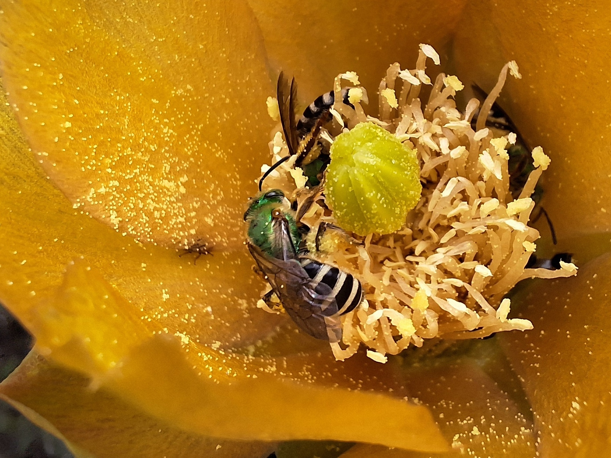

<figure align="center">
  
  
  <figcaption>
    Pollinator species of Quito.
  </figcaption>
</figure>


# Using Citizen Science to Study Pollination Ecology in Quito, Ecuador
[](https://doi.org/10.64898/2026.05.21.726748)
[](https://doi.org/10.5281/zenodo.20331044)


## Repository Structure
```text
├── Code/              R markdown and .html file with analysis workflows
├── Images/            Examples of photographies of pollination
├── Results/           Outputs and visualizations, including supplementary materials
└── README.md
```

This repository contains data, code, and supplementary materials related to research on plant–pollinator communities in Quito, Ecuador. Our first publication focuses on hymenopteran pollinators (bees and wasps) and is currently under review at the *Journal of Urban Ecology*.

## Resources

- Read our first study (preprint) in <a href="https://doi.org/10.64898/2026.05.21.726748">bioRxiv</a>.
- A brief guide to the code used in this research can be found <a href="https://davelascoc.github.io/pollinators-quito/Code/Pollinators_2026.html">here</a>.
- You can explore all citizen science records in our <a href="https://www.inaturalist.org/projects/polinizacion-quito">iNaturalist project</a>.
- The dataset and supplementary tables are also available in <a href="https://doi.org/10.5281/zenodo.20331044">Zenodo</a>.

<figure align="center">
  
  
  <figcaption>
    Map of the Quito Valley (project study area) and most common species recorded in the iNaturalist project.
  </figcaption>
</figure>

---

## Background & Project Impact

Despite Ecuador’s high biodiversity, quantitative studies on pollinator interactions remain limited in many regions. This project explores plant–pollinator communities in Quito through citizen science records and ecological analyses, aiming to support biodiversity research and monitoring in Ecuador.

This project documented numerous plant–pollinator interactions across Quito, revealing a diverse assemblage of hymenopteran pollinators associated with urban and peri-urban flora. Given the limited research on pollination ecology in Ecuadorian cities, citizen science has become an important tool for generating biodiversity records and expanding ecological knowledge at broad spatial and temporal scales. The records also highlight the frequent occurrence of the introduced honey bee (*Apis mellifera*), whose interactions with native pollinators may influence resource competition, community composition, and pollination dynamics, emphasizing the importance of long-term monitoring of native bee populations in Ecuador.

<figure align="center">
  
  
  <figcaption>
    Pollination network with the most common plant and hymenopteran species.
  </figcaption>
</figure>

---

## About the Project

This project was initiated in **2022** by **Daniel Velasco**, a USFQ alumnus, while working on terrestrial ecology at the Tropical Biodiversity Institute IBIOTROP, USFQ, before specializing in marine ecology. Although his current research focuses largely on marine ecosystems, this project remains active as a long-term effort to document pollinator communities and plant–pollinator interactions in Ecuador.

The work of botanists **Nelson Miranda** and **Gabriela Moya** has been essential for plant identifications. **Diego Cisneros-Heredia**, IBIOTROP director, advised Daniel during the conceptualization and development of the project.

## Future Directions & Collaboration

The analyses and manuscript currently available focus only on **Hymenoptera (bees and wasps)**. Future work aims to expand to additional pollinator groups including **Lepidoptera, Diptera, and Coleoptera**, providing a broader understanding of pollination ecology in the Quito Valley. The methodology developed here is also being adapted to studies in the **Galápagos Islands**, where documenting interactions involving native and nonnative species is crucial for ecological monitoring and conservation efforts.

This repository represents an ongoing project. Contributions and collaborations are welcome, particularly from students or researchers interested in pollination ecology and citizen science applications.

### Contact

Students interested in ecology, biodiversity, citizen science, taxonomy, or ecological networks are encouraged to reach out.

📧 Email: velascodaniel2002@gmail.com  
🔗 ResearchGate: [Daniel Velasco-Cedeño](https://www.researchgate.net/profile/Daniel-Velasco-Cedeno)
🔗 ORCID: [0000-0002-9527-5271](https://orcid.org/0000-0002-9527-5271)
🔗 LinkedIn: [davelascoc](https://www.linkedin.com/in/davelascoc)

<figure align="center">
  
  
  <figcaption>
    Agapostemon sp. visiting an Asteraceae flower.
  </figcaption>
</figure>
